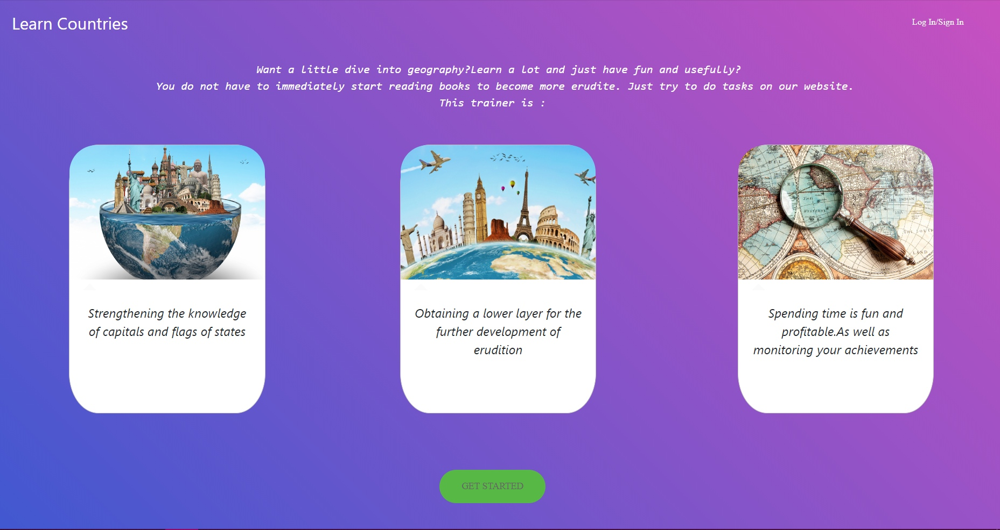

# LearnCountries
Study project for memorizing capitals and flags of countries

## Требования к проекту

### Проект LearnCountries

**Описание**

Веб-сервис,нацеленный на запоминание столиц и флагов государств пользователем

**Функциональные требования**

  1. Пользователь может выбирать на какие буквы он сегодня будет учить страны
  2. Пользователь может выбирать что он хочет учить:столицы или флаги
  3. Пользователь может отслеживать свой рейтинг в общей таблице пользователей

**Технические требования**

Веб-приложение

  1. ASP.NET Core
  2. Entity Framework Core
  3. Razor Pages

**Интерфейс**

При открытии сайта, пользователь попадает на начальную страницу

Нажав любую из двух доступных кнопок, пользователь попадает на страницу входа

Нажав на "Create your account" пользователь попадет на страницу регистрации, где при отправке формы будет перемещен обратно на страницу входа

Пользователи сайта делятся на два типа:
1) Администратор
2) Обычный пользователь

Введя свою почту и пароль, пользователь попадает на свою страницу

Здесь пользователь может:
1) Изменить свой аватар (нажав на него и выбрав картинку с компьютера)
2) Выбрать на какие буквы он хочет изучать страны и что он хочет изучать(столицы или флаги), а также выбрать количество заданий

Выбрав вариант "Capitals", пользователь попадает на страницу с заданиями по выбору столицы страны, где он выбирает вариант ответа и ему сразу показывается правильный вариант. Если пользователь выбрал правильный вариант, ему добавляется 10 баллов. Слева можно увидеть топ-3 пользователей сайта и позицию и количество баллов самого пользователя

Выбрав вариант "Flags",пользователь попадает на страницу с заданиями по выбору страны которой принадлежит данный флаг. Все остальное аналогично страницы со сталицами

По завершении заданий пользователь попадает на финальную страницу

Если на сайт заходит администратор, он точно так же вводит свою почту и свой пароль и попадает на свою страницу 

Пользователь может также решать задания и обновлять аватар. Помимо этого админу доступны три новые функции:
1) Создать страну
2) Изменить интервал количества заданий
3) Посмотреть и обновить страны

При нажатии на "Create new country", админ попадает на страницу создания страны:

Здесь админ просто вводит название страны, ее столицу и загружает изображение флага

При нажатии на "Change", админ попадает на страницу изменения диапозона числа заданий

Админ вводит начальное и конечное значение и при отправке сайт перенаправляет его обратно на его страницу

При нажатии на "Show all countries" админ попадает на страницу с полным списком имеющихся стран

Рядом с каждой страной есть кнопка "Update", нажав на которую, админ попадает на страницу обновления страны

Здесь админ, аналогично со страницей создания страны, вводит ее измененные значения и неизмененные тоже и, отправив форму, возвращается на свою страницу 
